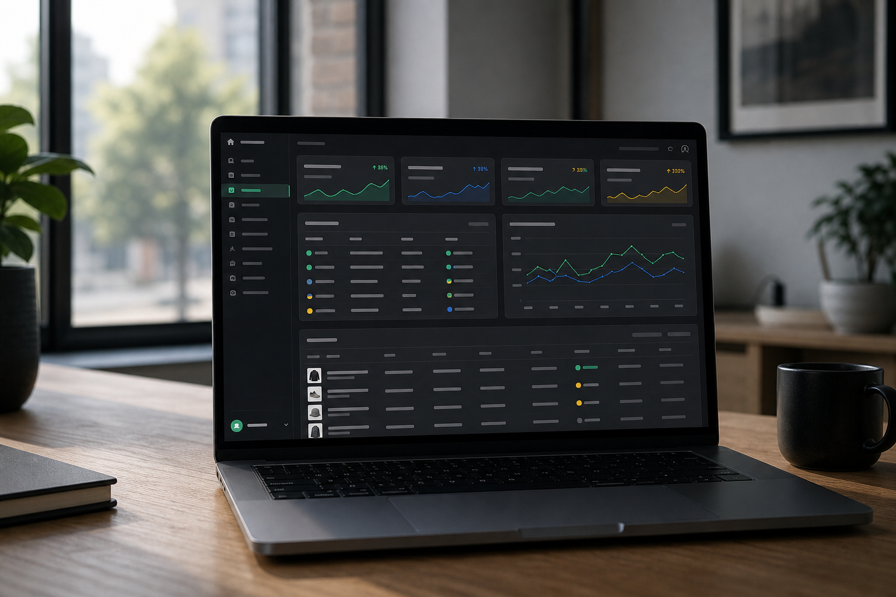
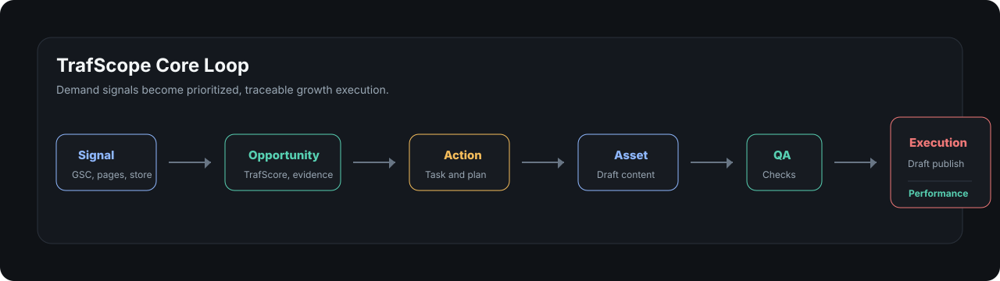
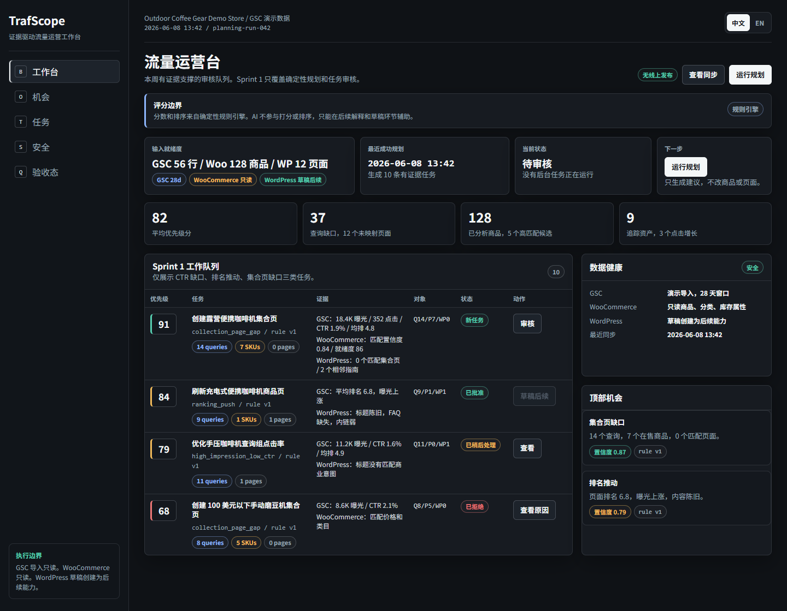
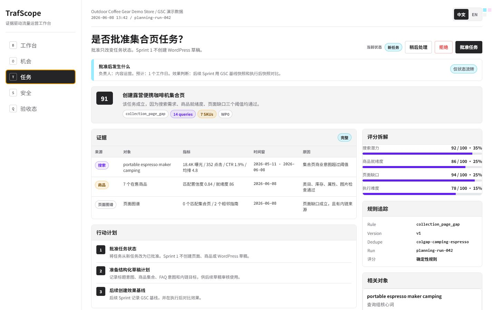
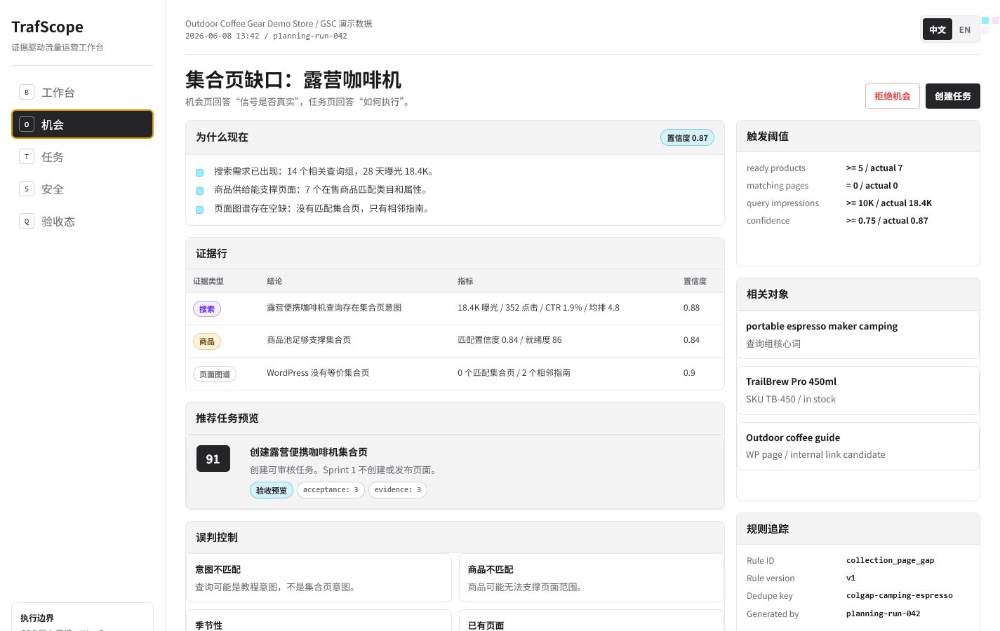
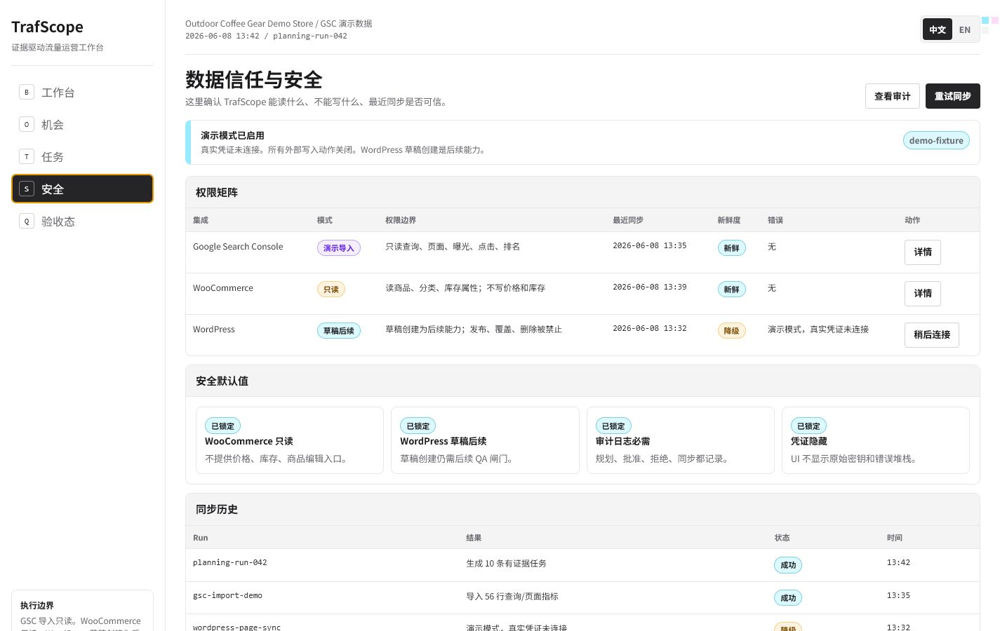
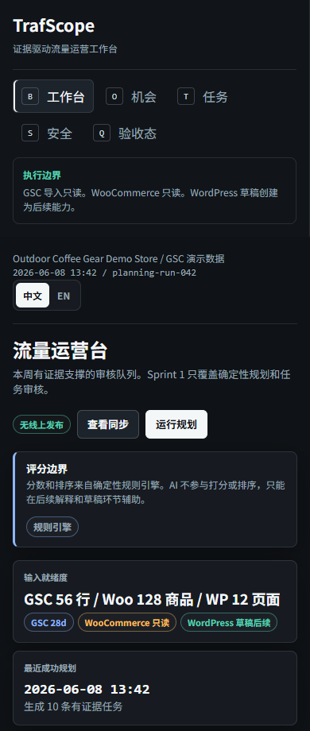
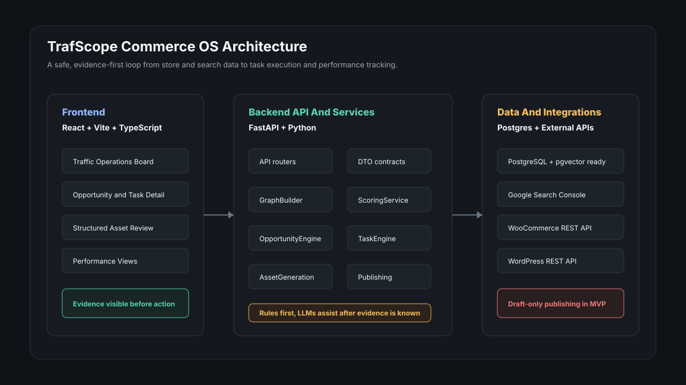

# TrafScope Commerce OS



TrafScope is an AI-powered traffic opportunity engine for WooCommerce and WordPress businesses.
It finds demand signals from search data, product data, website pages, and execution history, then turns those signals into prioritized growth tasks, draft content assets, and measurable performance loops.

Positioning: **AI-powered full-channel traffic opportunity engine**.

Repository: https://github.com/guangzibodong/AI-powered-traffic-opportunity-engine

## Product Positioning

Traditional SEO tools show keywords, rankings, audits, and charts. TrafScope is designed to answer a more operational question:

> What should this store do next to capture hidden organic traffic?

The product focuses on the full traffic execution loop:



## Current Product UI

Sprint 1 implements a bilingual, evidence-first traffic operations workspace. The UI is intentionally a product workbench, not a landing page.



| Task Detail | Opportunity Detail |
|---|---|
|  |  |

| Integrations And Safety | Mobile Board |
|---|---|
|  |  |

## Who It Is For

- WooCommerce and WordPress merchants with 50-2,000 SKUs.
- SEO teams that need a task board instead of another reporting dashboard.
- Content marketing teams that want evidence-backed page ideas.
- B2B and ecommerce growth teams looking for organic traffic opportunities.
- Agencies managing WordPress and WooCommerce growth work for multiple clients.
- Brands preparing for AI search visibility and citation workflows.

## What TrafScope Does

TrafScope connects store data, Google Search Console signals, WordPress pages, and execution history to generate practical traffic actions. The full roadmap includes:

- Find high-impression, low-click query opportunities.
- Identify ranking-push keywords that are close to page-one or top-three wins.
- Map queries to products, product pages, collection pages, guides, and comparison assets.
- Score opportunities with deterministic TrafScore and ProductReadiness logic.
- Generate tasks with evidence, related objects, action plans, and acceptance criteria.
- Prepare future draft assets such as SEO pages, buying guides, comparison pages, FAQ blocks, and metadata.
- Send future WordPress draft-only content after human approval; Sprint 1 does not create drafts.
- Track clicks, impressions, ranking movement, AI citation signals, and conversion impact.

## How The Engine Works

TrafScope separates deterministic decisioning from AI assistance. Rules and scores decide what should be reviewed first; AI is only allowed to assist later with explanations and drafts.


Sprint 1 visible rules:

| Rule | Trigger | Recommended task |
|---|---|---|
| `collection_page_gap` | Search demand maps to at least 3 matching products, but no strong existing page exists. | Create a collection page task. |
| `high_impression_low_ctr` | Existing page has high impressions, low CTR, and is still within ranking range. | Refresh title/meta and CTR messaging. |
| `ranking_push` | Existing page ranks around positions 4-20 with meaningful impressions. | Expand content and improve internal links. |

See [docs/product-logic.md](docs/product-logic.md) for the detailed business logic, scoring weights, state model, and safety boundaries.

## MVP Scope

The first build is not a broad SEO suite. It is a focused traffic operations loop for WooCommerce and WordPress.

| Area | MVP Decision |
|---|---|
| Primary platform | WooCommerce plus WordPress |
| Search data | Google Search Console, starting with demo or imported fixtures |
| Core screen | Traffic Operations Board |
| Core proof | At least 10 prioritized, evidence-backed tasks from demo data |
| Decisioning | Deterministic rules first, LLMs assist with explanations and drafts |
| Publishing | Future WordPress draft-only flow, never automatic live publish; Sprint 1 has no draft creation |
| Tracking | GSC performance snapshots and before-after asset tracking |

Deferred from MVP: Shopify, backlink databases, full AI visibility monitoring, TikTok, YouTube, Reddit, Xiaohongshu scraping, GA4, Merchant Center, and fully autonomous publishing.

## Product Surfaces

The first version is a working product experience, not a marketing landing page.

- Traffic Operations Board: top tasks, integration health, weekly planning, key metrics.
- Opportunities: rule-based traffic opportunities with score breakdowns and evidence.
- Task Detail: why this task exists, affected queries/products/pages, action plan, acceptance criteria.
- Asset Draft Review: future structured draft review for titles, slugs, metadata, sections, FAQ, schema, and internal links.
- Performance: tracking state and before-after GSC movement.
- Settings and Integrations: WooCommerce, WordPress, GSC, sync status, safety controls.

## Current Sprint Status

Sprint 1 is complete. The Sprint 2 local/import-only loop is complete and handed off in [Sprint 2 Local Import Handoff](docs/sprint-2-local-import-handoff.md). Sprint 3 now has local asset workspace, safe local editor, and read-only imported performance diagnostics, with the current demo release summarized in [Local Demo Release Handoff](docs/local-demo-release-handoff.md). The current branch still does not connect real GSC OAuth, collect live credentials, write WooCommerce data, create WordPress drafts, update WordPress pages, or publish content.

Completed capabilities in the current Sprint 1 slice:

- Demo planning endpoints return deterministic opportunities and tasks from fixture data.
- The API-backed board can load demo planning data when `VITE_USE_API_BOARD=true`.
- Task review states are limited to `new`, `approved`, `rejected`, and `snoozed`.
- The backend supports demo task status changes through `PATCH /api/stores/{store_id}/tasks/{task_id}`.
- Backend convenience endpoints also support `POST /approve`, `POST /reject`, and `POST /snooze` for demo tasks.
- Demo task status overrides are in-memory and reflected in both task list and task detail responses during the current API process.
- The visible React task buttons call `updateTaskStatus` when API board data is connected, with local state retained as the safe fallback.
- Task Detail review controls show accessible pending, synced, and API-unavailable fallback feedback while disabling duplicate submissions during sync.
- API-unavailable fallback feedback now exposes explicit `Retry sync` and `Keep local` controls, so the user can either re-attempt the demo API mutation or intentionally keep the local review state.
- Automated browser smoke coverage is available through `pnpm --filter @trafscope/web run test:api-actions`; it launches isolated local API/web ports and verifies API success, API fallback, retry sync, keep-local confirmation, unsafe status rejection, and board/detail consistency.

Sprint 2 local/import-only capabilities completed:

1. CSV GSC import foundation: `POST /api/stores/{store_id}/queries/import-csv`.
2. Imported query list/detail reads: `GET /queries` and `GET /queries/{query_id}`.
3. In-memory idempotent imported rows per store and date window, with no live OAuth.
4. Lightweight imported query clustering: `GET /api/stores/{store_id}/query-clusters` groups related imported rows into deterministic demand clusters with totals, CTR, weighted position, row ids, and top pages.
5. WooCommerce product import foundation: `POST /api/stores/{store_id}/products/import-woocommerce` normalizes read-only product fixtures into store-scoped product rows with list/detail APIs.
6. WordPress page import foundation: `POST /api/stores/{store_id}/pages/import-wordpress` normalizes read-only page/post fixtures into store-scoped page rows with list/detail APIs.
7. Imported signal graph foundation: `GET /api/stores/{store_id}/imported-graph` links imported query clusters to imported products and pages through local deterministic matching.
8. Imported opportunity preview foundation: `GET /api/stores/{store_id}/imported-opportunities` produces read-only opportunity previews for CTR refreshes, collection page gaps, and product SEO gaps from imported data.
9. Imported task preview foundation: `GET /api/stores/{store_id}/imported-tasks` converts imported opportunity previews into recommend-only action plans with evidence, acceptance criteria, safe `new` status, and no draft or external write path.
10. Integration status and sync run tracking foundation: `GET /integrations`, stub connect endpoints, `POST /sync`, and sync run list/detail reads track safe local state without OAuth, publishing, drafts, or commerce writes.
11. Audit log foundation: integration stub connects and sync tracking actions record sanitized local audit events, with `GET /audit-logs` list/detail reads and no secret, publishing, draft, or commerce write path.
12. Stable frontend DTO conversion foundation: the API client and view-model adapters now type and safely convert integration status, sync run, and audit log payloads without changing the visible Sprint 1 UI.
13. API-backed safety panel foundation: the React app now reads integration status, sync run tracking, and audit logs in API mode and feeds the existing Safety surface through safe read-only adapters.
14. Imported preview frontend DTO foundation: the API client and adapters now type read-only imported query clusters, imported opportunities, and imported task previews for future UI rendering.
15. API-backed imported preview UI renders read-only query clusters, catalog references, opportunity previews, task previews, section health, catalog overflow, action-share diagnostics, and action-mix diagnostics.
16. Browser smoke coverage reconciles imported action-share and action-mix counts, shares, row states, styling, aggregate totals, and top-row diagnostics across populated, empty, balanced, fallback, and partial-failure states.
17. Live integration handoff remains parked on credentials and boundary approval through `TASK-S2-LIVE-011`.

Sprint 3 local/demo capabilities completed:

1. Local asset workspace safety foundation and local asset candidate persistence from approved demo tasks.
2. Safe local asset editor for structured local fields, with browser coverage for save, failure, retry, close, stale feedback, and cross-asset isolation states.
3. Mobile and desktop local editor screenshot artifacts for bilingual responsive QA.
4. Safe local asset QA check detail mapping with allowlisted keys/statuses and no QA mutation controls.
5. Read-only store performance snapshots from already-imported GSC data.
6. Read-only selected-asset performance snapshots with local token matching.
7. Store and asset before/after comparison diagnostics that mark follow-up metrics as not yet tracked.
8. Stable source, snapshot id, evidence count, query/page count, blocked capability, and empty/unavailable diagnostics.
9. Local performance refresh preview diagnostics and audit mapping stay preview-only, local, and hidden from executable UI controls.
10. Local asset QA and claim ledger diagnostics include read-only row, status, source, total, and source distribution reconciliation against safe local rows.
11. Visible local asset rows include read-only content block type distribution diagnostics that reconcile to safe content block counts without rich text editing, draft creation, publishing, sync, credentials, product edits, or commerce writes.
12. The local asset editor shows read-only content block type distribution diagnostics that reconcile to the selected asset's safe content block count without adding rich text, draft, publish, sync, credential, product edit, or commerce-write controls.
13. The local asset editor shows read-only content block count reconciliation diagnostics that match editor-visible type rows to the selected asset's safe content block count.
14. The local asset editor shows read-only QA status distribution diagnostics that reconcile to safe QA detail rows without adding QA mutation, draft, publish, sync, credential, product edit, or commerce-write controls.
15. The local asset editor shows read-only QA count reconciliation diagnostics that match safe QA detail rows and pending rows without adding QA mutation, draft, publish, sync, credential, product edit, or commerce-write controls.
16. Local demo release handoff keeps live OAuth, credentials, WordPress drafts/page updates/publishing, and WooCommerce writes blocked.

Current product/engineering ownership:

| Area | Owner Role | Current Responsibility |
|---|---|---|
| Product ops and docs | Product Ops / Documentation Lead | Keep sprint scope, role split, completed capability, and next API action docs current. |
| Sprint coordination | Tech Lead / Facilitator | Protect the demo decisioning boundary and coordinate parallel work. |
| Demo planning API | Backend/API Engineer | Maintain deterministic demo endpoints and task status mutation behavior. |
| Traffic workspace UI | Frontend Product Engineer | Connect API-backed board and task actions while preserving safe fallback behavior. |
| Verification | QA / Test Lead | Cover scoring, dedupe, state transitions, API contracts, fallback states, and release gates. |

## Architecture



TrafScope is organized as a monorepo with a FastAPI backend, a Vite/React frontend, shared TypeScript contracts, SQL migrations, and product documentation.

```txt
apps/
  api/       FastAPI backend, services, integrations, workers, tests
  web/       Vite, React, TypeScript product workbench
packages/
  shared/    Shared TypeScript types and LLM contracts
infra/       Docker Compose and SQL migrations
docs/        Product, API, architecture, design, QA, and planning docs
```

## Technology Stack

| Layer | Stack |
|---|---|
| Frontend | React, Vite, TypeScript |
| Frontend state | Planned: TanStack Query, React Router, React Hook Form, Zod |
| Backend API | FastAPI, Python |
| Database | PostgreSQL, with pgvector reserved for future matching and embeddings |
| Background work | Planned: RQ or Celery for sync, planning, generation, and publishing jobs |
| Integrations | Google Search Console, WooCommerce REST API, WordPress REST API |
| AI layer | LLM-assisted asset generation with strict JSON contracts |
| Testing | Python unittest now, planned pytest and frontend component/E2E tests |
| Local infra | Docker Compose |

See [docs/tech-stack.md](docs/tech-stack.md) for the detailed stack decisions and rationale.

## Local Development

Install dependencies from the repo root:

```bash
corepack enable
pnpm install
```

Backend:

```bash
cd apps/api
python -m venv .venv
.venv/Scripts/activate
pip install -e ".[dev]"
uvicorn app.main:app --reload
```

Frontend:

```bash
pnpm --filter @trafscope/web run dev
```

API-backed demo board:

```bash
pnpm run dev:api
```

In another terminal:

```bash
cd apps/web
pnpm run dev
```

Set `VITE_USE_API_BOARD=true` before starting the web app to load from the demo API. In PowerShell:

```powershell
$env:VITE_USE_API_BOARD='true'
pnpm run dev
```

If the API is unavailable, the web app keeps the safe mock board and shows a fallback state.

Infrastructure:

```bash
docker compose -f infra/docker-compose.yml up -d
```

Backend tests:

```bash
cd apps/api
python -B -m unittest discover app/tests
```

Frontend checks:

```bash
pnpm --filter @trafscope/web run test:ui-contract
pnpm --filter @trafscope/web run lint
pnpm --filter @trafscope/web run build
```

## Safety Defaults

- No live WordPress publishing in MVP.
- WordPress publishing creates drafts only.
- WooCommerce sync is read-only.
- GSC import and planning runs must be idempotent.
- Every write action should create an audit log.
- Generated content must not invent product claims, prices, reviews, certifications, stock status, or competitor facts.
- Every opportunity and task must include evidence and score explanation.

## Roadmap

### Sprint 1: Demo Decisioning Loop

Prove TrafScope can turn demo store data and GSC-like signals into trustworthy tasks.

- Demo store and GSC fixtures.
- ProductReadiness and TrafScore scoring.
- Query-product-page graph.
- Opportunity rules for CTR refresh, ranking push, and collection page gaps.
- Task generation, dedupe, and state model.
- API-backed task board and opportunity detail.
- API-backed task review actions for approve, reject, and snooze.

### Sprint 2: Real Store Sync

Connect the decisioning loop to real store data. The local/import-only slice is complete; real live connection work remains blocked until credential handling and safety boundaries are approved.

- CSV GSC export import foundation for query/page metrics.
- Deterministic lightweight query clustering over imported GSC rows.
- WooCommerce read-only product sync.
- WooCommerce-like product fixture import with normalized categories, attributes, stock state, prices, and image URLs.
- WordPress read-only page/post sync.
- WordPress-like page/post fixture import with normalized URLs, titles, status, SEO metadata, indexability, and content hashes.
- Imported query-product-page graph matching over local imported rows.
- Imported opportunity previews with deterministic evidence and dedupe keys.
- Imported task previews with recommend-only action plans and safe read-only detail APIs.
- Integration status and sync run tracking.
- Audit logs.
- Stable frontend DTO conversion.
- API-backed imported preview UI and browser QA for imported action diagnostics.
- Parked live integration handoff for GSC OAuth, WooCommerce reads, and WordPress reads.

### Sprint 3: Draft Asset and Feedback Loop

Let users approve a task, generate a structured draft, create a WordPress draft, and track performance.

- Asset draft persistence.
- Structured draft editor.
- SEO metadata, FAQ, schema, and QA checks.
- WordPress draft-only publishing.
- Performance snapshots and before-after views.

## Key Docs

- [Product spec](docs/product-spec.md)
- [Product logic](docs/product-logic.md)
- [Architecture](docs/architecture.md)
- [Tech stack](docs/tech-stack.md)
- [Tech stack decision](docs/tech-stack-decision.md)
- [MVP PRD](docs/mvp-prd.md)
- [MVP release gates](docs/release-gates.md)
- [Local demo release handoff](docs/local-demo-release-handoff.md)
- [Sprint 2 local import handoff](docs/sprint-2-local-import-handoff.md)
- [Sprint 3 asset workspace handoff](docs/sprint-3-asset-workspace-handoff.md)
- [Sprint 3 performance snapshot UI contract](docs/sprint-3-performance-snapshot-ui-contract.md)
- [MVP requirements and tech stack meeting](docs/meetings/2026-06-08-mvp-requirements-tech-stack.md)
- [API surface](docs/api.md)
- [Design system](DESIGN.md)
- [UI stage kickoff](docs/meetings/2026-06-08-ui-stage-kickoff.md)
- [Sprint 1 UI screens](docs/ui-screens-sprint-1.md)
- [UI components](docs/ui-components.md)
- [UI implementation plan](docs/ui-implementation-plan.md)
- [UI visual QA checklist](docs/ui-visual-qa-checklist.md)
- [V3 UI concept](docs/design-mockups/trafscope-ui-concept-v3.html)
- [Requirements workshop](docs/requirements-workshop.md)
- [Sprint 1 backlog](docs/sprint-1-backlog.md)
- [API adapter plan](docs/api-adapter-plan.md)
- [Team operating model](docs/team-operating-model.md)
- [Automation task board](docs/automation-task-board.md)
- [QA strategy](docs/qa-sprint-1.md)
