# TrafScope Product Logic

This document explains how TrafScope turns traffic signals into opportunities, tasks, assets, and performance feedback. It is written as the operating logic for the product and should stay aligned with the backend services and Sprint scope.

## Core Principle

TrafScope is not a generic SEO dashboard. It is a traffic opportunity engine.

The product must answer one operational question:

> What should this business do next to capture hidden organic traffic, and why?

Sprint 1 proves the decisioning loop with demo data and deterministic rules. AI does not calculate scores, rank opportunities, or create external changes in Sprint 1.

## System Loop

```mermaid
flowchart LR
  Signal["Signal<br/>search, product, page, execution data"]
  Normalize["Normalize<br/>typed rows and store scope"]
  Graph["Graph<br/>query clusters, products, pages"]
  Opportunity["Opportunity<br/>rule-triggered traffic gaps"]
  Task["Task<br/>evidence-backed next action"]
  Asset["Asset<br/>structured draft, future gated"]
  QA["QA<br/>SEO, GEO, factual, safety checks"]
  Execution["Execution<br/>manual action or WordPress draft"]
  Performance["Performance<br/>GSC snapshots and outcomes"]

  Signal --> Normalize --> Graph --> Opportunity --> Task --> Asset --> QA --> Execution --> Performance
  Performance --> Signal
```

## Input Signals

| Source | Current role | Examples | Safety default |
|---|---|---|---|
| Google Search Console | Search demand and performance | Query, page, impressions, clicks, CTR, average position | Read/import only; CSV import before OAuth |
| WooCommerce | Product fit and commerce readiness | Product title, categories, stock attributes, images | Read only |
| WordPress | Existing page graph | Pages, posts, URLs, titles, candidate matches | Draft-only writes later |
| Execution history | Outcome feedback | Approved tasks, draft assets, baseline snapshots | Audit logged |
| AI/search/community channels | Future opportunity signals | AI citations, Reddit, forums, video scripts | Deferred from Sprint 1 |

## Core Objects

| Object | Meaning |
|---|---|
| Store | A scoped merchant workspace. All data and actions belong to a store. |
| Integration | Connection state and permissions for GSC, WooCommerce, and WordPress. |
| Product | Commerce object used for product fit and readiness. |
| Page | Existing WordPress page or post used for page-match and gap analysis. |
| Search metric | GSC-like query/page performance row. |
| Query cluster | A group of related demand signals mapped to possible products and pages. |
| Opportunity | A rule-triggered growth gap with score, evidence, and dedupe key. |
| Task | A reviewable action created from an opportunity. |
| Asset | A future structured draft connected to an approved task. |
| Performance snapshot | Baseline and follow-up metrics used to judge impact. |

## Decisioning Graph

The graph builder converts raw store/search data into relationships the rule engine can evaluate:

1. Group search queries into query clusters.
2. Match query clusters to products.
3. Match search metrics to existing WordPress pages.
4. Identify clusters with no strong existing page.
5. Preserve evidence rows so every opportunity can explain itself.

The graph is the bridge between data and action. TrafScope should never generate a task from a naked keyword without related evidence.

Sprint 2 imported CSV rows use a lightweight deterministic clustering path before richer graph matching exists:

- Normalize each query into lowercase alphanumeric tokens.
- Remove generic modifiers such as `best`, `buy`, `for`, and `with`.
- Group rows when two or more meaningful tokens overlap with an existing cluster.
- Pick the primary query by highest impressions.
- Aggregate clicks, impressions, CTR, impression-weighted average position, source row ids, and top pages.

This keeps imported demand grouping local and explainable. It does not use embeddings, LLM calls, OAuth, WooCommerce writes, or WordPress writes.

Sprint 2 WooCommerce product imports use the same local-first pattern:

- Accept WooCommerce-like product rows from fixture/import payloads or a read-only client.
- Normalize external id, name, slug, SKU, status, permalink, price, stock status, categories, attributes, and image URLs.
- Store rows idempotently by `store_id + external_id`.
- Sort readable product lists with in-stock published products first.
- Preserve stock and category evidence for later query-product matching.

This is still a read/import foundation. It does not create, update, delete, price-edit, inventory-edit, or publish WooCommerce data.

Sprint 2 WordPress page imports complete the initial product-page-search substrate:

- Accept WordPress-like page and post rows from fixture/import payloads or a read-only client.
- Normalize external id, URL, title, slug, status, page type, excerpt, SEO metadata, indexability, and content hash.
- Store rows idempotently by `store_id + external_id`.
- Sort readable page lists with indexable published pages first.
- Preserve page URL and SEO evidence for later page-match, gap, and refresh rules.

This remains read-only. It does not create drafts, overwrite pages, publish content, or call WordPress write operations.

Sprint 2 imported signal graph matching connects those imported signals:

- Read imported query clusters, products, and WordPress pages for one store.
- Match query clusters to products only when three or more meaningful tokens overlap.
- Match query clusters to pages first through exact GSC top-page URLs, then conservative token overlap.
- Mark the best existing page only when the matched page is published and indexable.
- Return aggregate graph counts so later opportunity generation can explain its substrate.

This graph layer is deterministic and read-only. It does not call embeddings, LLMs, GSC, WooCommerce, or WordPress.

Sprint 2 imported opportunity previews apply a small rule set to the imported graph:

- `high_impression_low_ctr`: best existing imported page exists, impressions are at least 1,000, CTR is 3% or lower, and average position is 20 or better.
- `collection_page_gap`: no best existing imported page exists and at least three imported products match the cluster.
- `product_seo`: no best existing imported page exists, one or two in-stock published imported products match the cluster, impressions are at least 800, and average position is 20 or better.

Preview opportunities include rule metadata, dedupe keys, TrafScore components, evidence, related products/pages, and status `new`. They do not create tasks, drafts, assets, sync jobs, or external writes.

Sprint 2 imported task previews convert those imported opportunities into a safe Action layer:

- Generate deterministic task preview ids from imported opportunity dedupe keys.
- Preserve source opportunity metadata, related page/product evidence, TrafScore, confidence, and source summaries.
- Emit category-specific action plans for `ctr_refresh`, `collection_page`, and imported `product_seo`.
- Keep every imported task preview at `automation_level: recommend_only` and `status: new`.
- Expose list/detail reads only; no approval, rejection, snooze, draft, publishing, or commerce write path exists for imported previews.

Sprint 2 integration status and sync run tracking makes the imported-data loop observable before real credentials exist:

- Provider connect endpoints record local `connected_stub` state for GSC, WooCommerce, and WordPress.
- Integration reads expose safe operations and blocked capabilities instead of secrets or raw auth payloads.
- `POST /sync` creates a queued `tracking_only` sync run with provider steps.
- Sync run steps keep `external_write_allowed: false` and zero record counts until a later read-only worker actually fills them.
- No real GSC OAuth, WooCommerce write, WordPress draft, WordPress publish, or external job execution is triggered by this foundation.

Sprint 2 audit logs create a safe event trail for those local actions:

- Integration stub connections write `integration.connected_stub` audit entries.
- Sync run queue records write `sync.queued` audit entries.
- Audit metadata is sanitized before storage so passwords, tokens, secrets, and API keys are redacted.
- Audit entries are read-only and carry `safety_scope: local_tracking_only`.
- Audit logging records what happened, but it does not create drafts, publish content, write commerce data, or execute external jobs.

Sprint 2 frontend DTO conversion keeps those backend surfaces safe before UI panels are connected:

- The API client owns typed response contracts for integration status, sync runs, and audit logs.
- View-model adapters map provider status into existing `IntegrationHealth` rows.
- Unknown integration and sync run statuses fall back to safe UI states.
- Backend `external_write_allowed` flags are inspected but frontend sync previews clamp `externalWriteAllowed` to `false`.
- Audit logs can be converted into `audit` evidence rows without exposing metadata secrets or execution controls.

Sprint 2 API-backed safety UI wiring consumes those DTOs in the existing Safety surface:

- API board mode reads integration status, sync run tracking, and audit logs alongside tasks and opportunities.
- The visible Safety page renders `board.integrations` so API-backed integration status can replace static mock rows.
- Sync and audit signals are preview-only; buttons do not trigger sync execution, credential handshakes, draft creation, publishing, or commerce writes.

Sprint 2 imported preview frontend DTOs prepare the UI for imported-data review without changing execution boundaries:

- Imported query clusters become preview rows with `Imported GSC` evidence.
- Imported opportunities reuse deterministic rule mapping into frontend opportunity view models.
- Imported task previews become frontend tasks with `automationLevel: recommend_only` and safe visible status fallback.
- These DTOs are read-only and do not add review mutation, draft generation, credential, sync execution, publishing, or commerce write controls.

## Sprint 1 Opportunity Rules

Sprint 1 exposes only three user-visible rule types.

| Rule ID | Trigger logic | Output |
|---|---|---|
| `collection_page_gap` | Query cluster has no best existing page and at least 3 matched products. | A collection page task. |
| `high_impression_low_ctr` | Existing page exists, impressions are at least 1,000, CTR is 3% or lower, and average position is 20 or better. | A CTR refresh task. |
| `product_seo` | Imported cluster has no best existing page and 1-2 in-stock published matched products. | A product SEO task preview in Sprint 2 imported mode. |
| `ranking_push` | Existing page exists, average position is 4-20, impressions are at least 800, and CTR is above 3%. | A ranking push task. |

Each opportunity receives:

- `rule_id`
- `rule_version`
- `dedupe_key`
- `trafscore`
- `confidence`
- `score_components`
- evidence rows
- recommended task type

The opportunity list is deduped by key and sorted by deterministic TrafScore.

## TrafScore

TrafScore is a weighted deterministic score. It ranks review priority, but it does not claim perfect revenue attribution.

| Component | Weight |
|---|---:|
| `traffic_potential` | 0.18 |
| `intent_score` | 0.16 |
| `product_fit_score` | 0.14 |
| `revenue_fit_score` | 0.14 |
| `inventory_score` | 0.10 |
| `gap_score` | 0.12 |
| `timing_score` | 0.08 |
| `execution_ease` | 0.05 |
| `confidence_score` | 0.03 |

All component values must stay between 0 and 100. The backend rounds the weighted result to two decimal places.

## Product Readiness

ProductReadiness is reserved for product-fit and commerce execution checks.

| Component | Weight |
|---|---:|
| `stock_score` | 0.25 |
| `content_completeness` | 0.20 |
| `structured_data_completeness` | 0.15 |
| `review_score` | 0.10 |
| `image_score` | 0.10 |
| `price_competitiveness` | 0.10 |
| `conversion_proxy` | 0.10 |

The product readiness score helps TrafScope avoid recommending pages around products that are unavailable, poorly described, or not ready for traffic.

## Task Generation

The task service converts an opportunity into a reviewable task:

Task payloads must include:

- title
- category
- automation level
- status
- priority score
- evidence
- action plan
- source summary
- confidence
- acceptance criteria

Imported Sprint 2 task previews follow the same evidence and action-plan shape, but they are not persisted workflow tasks yet. They are recommendation previews for review and product validation, so the only allowed status is `new` and the only automation level is `recommend_only`.

Sprint 1 visible task statuses:

| Status | Meaning |
|---|---|
| `new` | Needs human review. |
| `approved` | Accepted for later execution or drafting. |
| `rejected` | Explicitly declined. |
| `snoozed` | Deferred without losing evidence. |

Sprint 1 must not expose `published`, `applied`, `autopilot`, or `one-click apply` states.

## Asset And QA Logic

Assets are future-gated from Sprint 1 UI, but the product model already reserves the flow:

1. Approved task becomes an asset draft candidate.
2. AI can generate structured drafts only from known evidence and product data.
3. QA checks validate SEO, GEO, factual grounding, schema, internal links, and safety.
4. WordPress draft creation happens only after human approval and QA.
5. Live publishing remains outside the MVP safety boundary.

AI must not invent:

- prices
- stock state
- reviews
- certifications
- product capabilities
- competitor claims
- unsupported performance claims

## Safety Boundaries

| Boundary | Rule |
|---|---|
| Scoring | Deterministic rules only. AI does not score or rank. |
| WooCommerce | Read-only in MVP. No price, inventory, or product writes. |
| GSC | Read/import only. CSV import rows and planning runs must be idempotent. |
| WordPress | Draft-only writes in later sprint. No live publish path. |
| Sync tracking | Sprint 2 sync runs are local tracking records only until real read-only workers and audit state are added. |
| Credentials | Never show raw credentials, stack traces, or keys in UI. |
| Audit | Current audit logs are sanitized local records; every future write action should create an audit log before execution expands. |

## Service Map

| Service | Owns | Does not own |
|---|---|---|
| `GSCIngestionService` | Import/query metrics and performance rows, starting with CSV exports. | Opportunity ranking or live OAuth. |
| `ProductSyncService` | WooCommerce product/category/attribute read sync. | Product writes. |
| `GraphBuilderService` | Query-product-page relationships. | Task state changes. |
| `OpportunityEngine` | Rule triggers, score components, dedupe. | AI drafting. |
| `ScoringService` | TrafScore and ProductReadiness math. | Business copy. |
| `TaskService` | Task templates, action plans, acceptance criteria. | Publishing. |
| `AssetGenerationService` | Future structured drafts. | Deterministic ranking. |
| `PublishingService` | Future WordPress draft creation. | Live publishing. |
| `PerformanceService` | Baseline and follow-up snapshots. | Unsupported attribution claims. |

## Sprint Roadmap Logic

| Sprint | Main proof |
|---|---|
| Sprint 1 | Demo decisioning loop: evidence-backed opportunities and tasks. |
| Sprint 2 | Real WooCommerce and WordPress sync with safety and audit state. |
| Sprint 3 | Asset drafts, QA checks, WordPress draft creation, and performance snapshots. |

The roadmap should expand only when the previous loop is credible. A broader channel surface is less important than making each generated task trustworthy.
